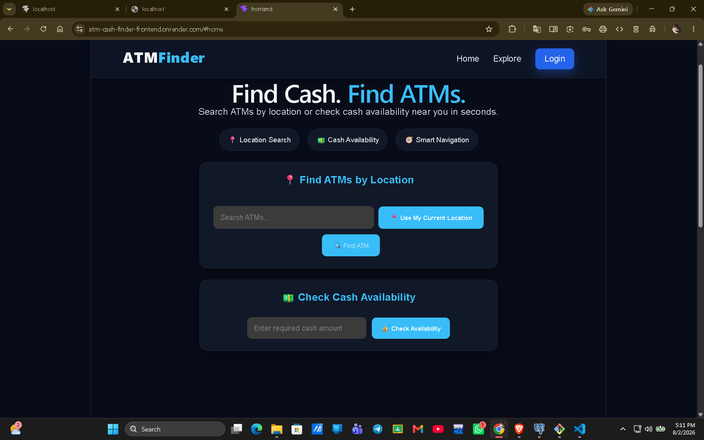

# ATM Cash Finder 💵📍

A full-stack web application that helps users find nearby ATMs and check cash availability based on their required amount.

## Features

- Search nearby ATMs
- Check cash availability for required amount
- Use current location
- Calculate distance between user and ATM
- Sort ATMs by distance
- Filter ATMs by bank
- View ATM locations on map
- Get navigation directions

## Tech Stack

Frontend:
- React.js
- Vite
- CSS

Backend:
- Node.js
- Express.js

Database:
- PostgreSQL (Neon)

Deployment:
- Render

## How It Works

1. User provides location or cash requirement.
2. Frontend gets user coordinates.
3. Backend receives API request.
4. Backend fetches ATM data from PostgreSQL.
5. Distance is calculated and nearest ATMs are displayed.

## Project Structure
ATM-Cash-Finder
|
├── frontend
|
└── backend

## API Endpoints

GET /api/atms

GET /api/atms/check

GET /api/atms/search

## Author

Yateesh Sai Simhadri

## Screenshots

### Home Page

## Live Demo

Frontend: https://atm-cash-finder-frontend.onrender.com

Backend API: https://atm-cash-finder.onrender.com/api/atms